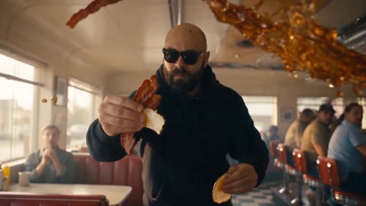

# All 9 Seedance 2.5 prompts

**Browse by use case:** [30s & Multi-Shot](#30s--multi-shot) (1) · [Candid & Handheld](#candid--handheld) (1) · [Dialogue & Lip Sync](#dialogue--lip-sync) (1) · [Action & Fight](#action--fight) (1) · [Cinematic & VFX](#cinematic--vfx) (2) · [Animation & Anime](#animation--anime) (1) · [Product & Ads](#product--ads) (1) · [Reference & Consistency](#reference--consistency) (1)

Every prompt with the clip it produced, credited and linked. Prompts the creator published are marked **author's own**; the ones we reverse-engineered from the finished clip are marked **reconstructed**.

## 30s & Multi-Shot

### 1. Thirty-second selfie day-in-the-life

<strong>Prompt</strong> — [GOAL] Generate a 30-second first-person phone vlog. The core subject is <WOMAN>, in her late twenties, shoulder-length dark brown hair, light natural makeup, who films herself at arm's length through one ordinary day. T…

[**Read the full prompt →**](https://apimodels.app/seedance-2-5-prompts#prompt-cb233d1612918f6dd6c62fa87) (2,420 chars, reconstructed)
· [full text in this repo (MIT)](./long-form/thirty-second-selfie-day-in-the-life.md)

**Source:** [@onofumi_AI](https://x.com/onofumi_AI/status/2083560874443432048) · 30s · 16:9

---
## Candid & Handheld

### 2. Handheld DV morning dog-walk vlog

<strong>Prompt</strong> — CAMERA: Handheld DV 16mm daily vlog footage. The video MUST begin with her holding the camera at arm's length in selfie mode while stepping outside her apartment building with her dog. The first 20–30 seconds are entirel…

[**Read the full prompt →**](https://apimodels.app/seedance-2-5-prompts#prompt-cf387801f8c35408450aff56f) (2,823 chars, author's own)

**Source:** [@maxxmalist](https://x.com/maxxmalist/status/2085422370362110168) · 15s · 16:9

---
## Dialogue & Lip Sync

### 3. Seven-shot bedroom candid — cat, phone call, doorbell

<strong>Prompt</strong> — Montage, multi-shot candid observational footage. Do not use a single camera angle or continuous take. Handheld documentary style with the feeling of accidental real-life capture. Slightly imperfect framing, subtle handh…

[**Read the full prompt →**](https://apimodels.app/seedance-2-5-prompts#prompt-c50b543be1ee8d4b7e609bbc0) (3,789 chars, author's own)

**Source:** [@oggii_0](https://x.com/oggii_0/status/2085640281941307648) · 15s · 16:9 · Higgsfield

---
## Action & Fight

### 4. Thirty seconds of hand-to-hand combat in a rain-flooded metro maintenance hall

<strong>Prompt</strong> — 生成一段完整30秒、16:9横屏、24fps、写实电影级质感的现代近身格斗视频。使用我上传的两组人物参考图：第一名人物固定为"主角"，第二名人物固定为"敌人"。严格继承参考图中两人的面部、年龄、发型、体型、身高比例、服装、鞋子、配饰和整体气质。全程不得交换身份，不得变脸、改变服装颜色、改变体型或生成第三名参战者。 【核心风格】 参考《一个人的武林》所呈现的现代硬派武术电影气质：动作迅猛、贴身、凶狠，攻防转换极快，拳脚具有真实接触感和明确…

[**Read the full prompt →**](https://apimodels.app/seedance-2-5-prompts#prompt-ccc25e6fc74a17881b0973efa) (4,576 chars, author's own)

**Source:** [@lansenai](https://x.com/lansenai/status/2083521805176988016) · 30s · 16:9

---
## Cinematic & VFX

### 5. Silhouette transformation in a lightning void

<strong>Prompt</strong> — [GOAL] Generate a 30-second transformation sequence. The core subject is <FIGURE>, a human form kept as a near-total silhouette from the first frame to the last. The main event is <FIGURE> walking out of a dark storm voi…

[**Read the full prompt →**](https://apimodels.app/seedance-2-5-prompts#prompt-c97a008aa714f8203046fcc07) (2,502 chars, reconstructed)
· [full text in this repo (MIT)](./cinematic/lightning-sorceress-transformation.md)

**Source:** [@LudovicCreator](https://x.com/LudovicCreator/status/2083976170932989982) · 30s · 16:9 · Dreamina

---
### 6. Building breakfast inside a frozen diner

<strong>Prompt</strong> — <MAN>, bald with a full dark beard, black hoodie and black sunglasses, walks the length of an American roadside diner in which everything except him is frozen in mid-air, assembling and eating a breakfast sandwich out of…

[**Read the full prompt →**](https://apimodels.app/seedance-2-5-prompts#prompt-c08cbbfc06a309699875c0d2d) (1,944 chars, reconstructed)
· [full text in this repo (MIT)](./cinematic/frozen-diner-breakfast-heist.md)

**Source:** [@TechHalla](https://x.com/techhalla/status/2085313653662707968) · 30s · 16:9

---
## Animation & Anime

### 7. The cat that has changed pose every time she walks past

<strong>Prompt</strong> — A girl carries a stack of books along the wooden corridor of an old Japanese house on a summer afternoon, passing the same sleeping cat four times; the cat is in a completely different sleeping position each time, and sh…

[**Read the full prompt →**](https://apimodels.app/seedance-2-5-prompts#prompt-c1e06ba0fe1177288153c5816) (1,884 chars, reconstructed)
· [full text in this repo (MIT)](./animation/the-cat-that-changes-pose-every-time.md)

**Source:** [@pan_soramame_da](https://x.com/pan_soramame_da/status/2085493871639994803) · 20s · 16:9 · Dreamina

---
## Product & Ads

### 8. The rice that rode the belt looking for its topping

<strong>Prompt</strong> — [GOAL] Generate a 30-second animated brand film for a conveyor-belt sushi restaurant. The core subject is <SHARI>, a palm-sized ball of vinegared sushi rice with a simple drawn face, blush cheeks and two stubby feet, rid…

[**Read the full prompt →**](https://apimodels.app/seedance-2-5-prompts#prompt-c82040b18cad435259556cd3e) (2,629 chars, reconstructed)
· [full text in this repo (MIT)](./product/conveyor-sushi-rice-finds-its-match.md)

**Source:** [@hahazwei](https://x.com/hahazwei/status/2085219893180563470) · 30s · 16:9 · Dreamina / 即梦

---
## Reference & Consistency

### 9. Red-hooded armoured soldier walking out of desert ruins

<strong>Prompt</strong> — @image1 supplies <SOLDIER>'s armour design, colour breakdown and silhouette: chipped bone-white and gunmetal plating, a heavy respirator faceplate with a single narrow red visor slit, and a sun-bleached crimson hood and…

[**Read the full prompt →**](https://apimodels.app/seedance-2-5-prompts#prompt-c1dae66061e5fca644483b51e) (1,691 chars, reconstructed)
· [full text in this repo (MIT)](./reference/red-hooded-mech-soldier-in-desert-ruins.md)

**Source:** [@LudovicCreator](https://x.com/LudovicCreator/status/2084217894926258534) · 30s · 16:9 · Dreamina

---
