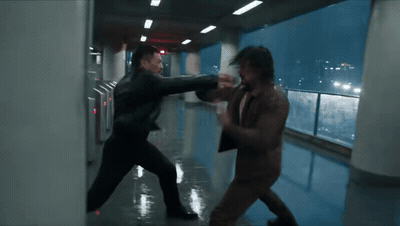

# Thirty seconds of hand-to-hand combat in a rain-flooded metro maintenance hall

- **Category:** Action & Fight
- **Clip:** 30s · 16:9
- **Prompt:** published by the author — full text on the [gallery page](https://apimodels.app/seedance-2-5-prompts#prompt-ccc25e6fc74a17881b0973efa), not copied into this repo (we do not own it).
- **Source:** [@lansenai](https://x.com/lansenai/status/2083521805176988016) — video by its author, linked for reference
- **In the gallery:** https://apimodels.app/seedance-2-5-prompts#prompt-ccc25e6fc74a17881b0973efa



## Why this one is worth reading

The longest prompt in this library at roughly 4,300 characters, and the clearest demonstration of what 30 seconds actually costs you in writing. Two locked identities from reference images, a fixed floor plan the camera may not contradict, five timed beats from 0-4s to 26-30s, a rule that every strike must show origin-path-contact-result, and a closing block of negative constraints. It also forbids the hero winning without being hurt — a dramatic instruction, not a technical one.

## Excerpt

```text
生成一段完整30秒、16:9横屏、24fps、写实电影级质感的现代近身格斗视频。使用我上传的两组人物参考图：第一名人物固定为"主角"，第二名人物固定为"敌人"。严格继承参考图中两人的面部、年龄、发型、体型、身高比例、服装、鞋子、配饰和整体气质。全程不得交换身份，不得变脸、改变服装颜色、改变体型或生成第三名参战者。 【核心风格】 参考《一个人的武林》所呈现的现代硬派武术电影气质：动作迅猛、贴身、凶狠，攻防转换极快，拳脚具有真实接触感和明确受力反馈，但不照搬电影中的人物、场景和具体镜头。以高质量ACT动作游戏的第三人称战斗镜头诠释两人对决，摄影机主要跟随主角，位于主角肩后、腰后或侧后方，使观众产生操控主角迎战强敌的沉浸感；关键格挡和重击时，可以短暂切入侧面中景或近景。 视频不要求真正一镜到底，可以在30秒内进行多次自然切镜，但整场战斗必须像一个连续长镜头般流畅。利用人物身体遮挡、立柱擦镜、快速摇镜、撞击震动和动作匹配完成隐形切镜。切镜后必须延续上一镜的动作惯性、人物位置、身体朝向、伤势和攻击方向，禁止瞬移、换位错误、人物突然恢复站姿或摄影机无理由越轴。 【场景】 深夜暴雨，一座已经停运的高架地铁检修站。站厅呈狭长矩形，地面是被雨水浸湿的深灰色防滑地砖，分布少量浅水洼，能够反射冷白顶灯和红色维修警示灯。左侧是一排金属检票闸机和关闭的卷帘门，右侧是半透明钢化玻璃护栏，护栏外能够看到高架轨道…
```

The full 4,576-character prompt is on the [gallery page](https://apimodels.app/seedance-2-5-prompts#prompt-ccc25e6fc74a17881b0973efa) with credit to its author, and in [the original post](https://x.com/lansenai/status/2083521805176988016).

**Run it** — Seedance 2.5 is live on apimodels.app as `seedance-2.5`: $0.134/s at 480p, $0.300/s at 720p, billed on real token usage and charged only on success.

```bash
curl -X POST https://apimodels.app/api/v1/video/generations \
  -H "Authorization: Bearer $APIMODELS_API_KEY" -H "Content-Type: application/json" \
  -d '{"model":"seedance-2.5","prompt":"<the full prompt from the gallery page>","duration":30,"resolution":"480p"}'
```

The five timed beats only fit at the full 30 s — $4.02 at 480p, $9.00 at 720p, and `duration` (4–30 s in one pass, or `-1` to let the model choose) is what moves the bill. The API exposes 480p and 720p only.

This prompt locks two identities from reference images of people: a raw photo that appears to contain a real person is rejected at create time, so real faces go through the `asset://` portrait library. [Docs](https://apimodels.app/docs/seedance-2-5) · [model](https://apimodels.app/models/seedance-2.5)

---

> 这条的中文说明:本库最长的一条，约 4300 字，也最能说明「30 秒」在写作上要付出什么。两个用参考图锁死的身份、一张镜头不得自相矛盾的平面图、从 0—4 秒到 26—30 秒五个计时段落、「每次进攻必须有起点—路径—接触点—结果」的硬规则，以及结尾一整块负向约束。它甚至禁止主角全程无伤取胜——那是叙事指令，不是技术指令。

**用 API 跑这条** — `seedance-2.5` 已在 apimodels.app 上线，命令同上（prompt 换成画廊页的全文）：480p $0.134/秒、720p $0.300/秒，按真实用量计费，只在成功时扣费。

五个计时段落只有跑满 30 秒才装得下：480p 约 $4.02，720p 约 $9.00，`duration` 才是账单的开关（单次 4–30 秒，或填 `-1` 让模型自己定）；API 只开放 480p 和 720p。这条要用两组真人参考图——看起来含真人的原图会在创建时被上游审核拒掉，真人一律走 `asset://` 人像库。文档：[/docs/seedance-2-5](https://apimodels.app/docs/seedance-2-5)
