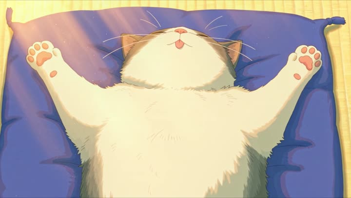

# The cat that has changed pose every time she walks past

- **Category:** Animation & Anime
- **Clip:** 20s · 16:9 · run on Dreamina
- **Prompt:** reconstructed by apimodels.app from the finished clip. A writing reference, **not** the author's prompt. MIT, full text below.
- **Source:** [@pan_soramame_da](https://x.com/pan_soramame_da/status/2085493871639994803) — video by its author, linked for reference
- **In the gallery:** https://apimodels.app/seedance-2-5-prompts#prompt-c1e06ba0fe1177288153c5816



## Why this one is worth reading

A repeated shot where exactly one thing changes is a good stress test: the model has to hold the entire set identical while deliberately altering the subject. Locking the layout in words is what makes the joke land.

## Prompt

```text
A girl carries a stack of books along the wooden corridor of an old Japanese house on a summer afternoon, passing the same sleeping cat four times; the cat is in a completely different sleeping position each time, and she never breaks stride until the last pass.

<GIRL> is a child of about ten in a white short-sleeved blouse and a blue jumper skirt, barefoot, hair tied back. <CAT> is a plump grey-and-white shorthair asleep on a blue floor cushion in the middle of the corridor. The house has shoji screens, tatami, an old electric fan turning in the background, and an open side that looks onto a bright green garden.

Pass one: <CAT> is curled into a tight circle, tail over nose. Pass two: <CAT> is stretched out flat on one side, front legs extended. Pass three: <CAT> is fully on its back, all four paws splayed upward, belly exposed, the tip of its tongue showing. Pass four: <CAT> has not moved at all and <GIRL> finally stops, kneels, and buries her face in its belly, smiling with her eyes shut.

The image is hand-painted 2D anime in a warm summer palette: visible brush texture in the greenery, soft cel shading, dust motes in low afternoon light, a faint rainbow flare where the sun crosses the lens, and gentle bloom on the paper screens.

The camera holds a locked-off wide of the corridor for each pass so the only thing that changes is the cat, cutting to a slow push-in on <CAT> after each pass to show the new pose, then finishing on a close-up of <GIRL>'s face against fur.

Keep the corridor layout, cushion position, fan and garden identical in all four passes. Keep <CAT>'s markings — grey saddle and cap, white chest, white paws — the same in every pose.

Sound includes cicadas, the fan's slow oscillation, bare feet on old wood, the paper screens rattling faintly, one small sleepy chirrup from <CAT>, and a sparse piano figure with long gaps. No dialogue.
```

## 提示词(中文)

```text
夏日午后，一个女孩抱着一摞书沿着日式老宅的木廊走过，四次经过同一只睡着的猫；每一次猫的睡姿都完全不同，而她直到最后一次都没有停下脚步。

<女孩> 约十岁，白色短袖衬衫配蓝色背带裙，赤脚，头发扎在脑后。<猫> 是一只圆胖的灰白短毛猫，睡在走廊中央的蓝色坐垫上。宅子有障子门、榻榻米，背景里一台老电扇在摇头，一侧完全敞开，望出去是明亮的绿色庭院。

第一次经过：<猫> 蜷成一个紧实的圆，尾巴盖住鼻子。第二次：<猫> 侧躺摊平，前腿伸直。第三次：<猫> 完全仰面朝天，四只爪子朝上摊开，肚皮敞着，舌尖露出一点。第四次：<猫> 一动没动，而 <女孩> 终于停下，跪坐下来，把脸埋进它的肚子里，闭着眼笑。

画面呈现手绘二维动画的暖色夏日质感：绿植中可见笔触、柔和的赛璐璐上色、午后低角度光里的浮尘、阳光扫过镜头时淡淡的彩虹光晕，以及纸障子上柔和的辉光。

镜头在每一次经过时都保持走廊的固定广角，使唯一变化的只有猫；每次经过之后切入对 <猫> 的缓慢推近，交代新的姿势；最后收在 <女孩> 贴着猫毛的面部特写。

四次经过中，走廊格局、坐垫位置、电扇和庭院必须完全一致。<猫> 的花色——灰色鞍斑与头顶、白胸、白爪——在任何姿势下都保持相同。

声音包括蝉鸣、电扇缓慢的摇头声、赤脚踩在旧木板上的声音、纸障子的轻微震响、<猫> 一声困倦的小咕噜，以及间隔很长的稀疏钢琴。没有对白。
```

---

> 这条的中文说明:「同一个镜头只变一样东西」是很好的压力测试：模型必须把整个场景钉死，同时刻意改变主体。用文字把布局锁住，这个梗才成立。
