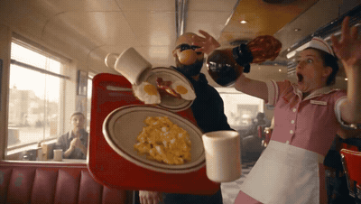

# Building breakfast inside a frozen diner

- **Category:** Cinematic & VFX
- **Clip:** 30s · 16:9
- **Prompt:** reconstructed by apimodels.app from the finished clip. A writing reference, **not** the author's prompt. MIT, full text below.
- **Source:** [@TechHalla](https://x.com/techhalla/status/2085313653662707968) — video by its author, linked for reference
- **In the gallery:** https://apimodels.app/seedance-2-5-prompts#prompt-c08cbbfc06a309699875c0d2d



## Why this one is worth reading

The hard part is not the freeze, it is that frozen things must be genuinely still. Models drift. Saying so explicitly — no drift, no wobble, no micro-motion — is worth more than any adjective about time stopping.

## Prompt

```text
<MAN>, bald with a full dark beard, black hoodie and black sunglasses, walks the length of an American roadside diner in which everything except him is frozen in mid-air, assembling and eating a breakfast sandwich out of the suspended debris as he goes.

The scene is a 1950s chrome-and-vinyl diner at mid-morning: red booths, a checkerboard floor, a long window wall with hard daylight, and a dozen customers held motionless. A waitress is caught at the peak of a collision — her tray tipping, plates, mugs, a fried egg, strips of bacon and a coffee pot all hanging in the air, the poured coffee suspended as one solid glossy ribbon.

<MAN> never hurries. He plucks a fried egg out of the air with two fingers, takes a strip of bacon off its arc, lays both onto a split biscuit still hovering at chest height, and eats it in unhurried bites while continuing to walk. He steps around the frozen waitress without touching her, reaches the door, pushes it open, and only as it swings shut behind him does the room release: cutlery lands, the coffee ribbon breaks, the tray hits the floor.

The image is live-action photoreal with a warm filmic grade, slight halation on the windows, fine grain, real specular highlights on chrome and glass, and physically correct suspended liquid that holds surface tension rather than looking like plastic. Everything frozen must stay absolutely still — no drift, no wobble, no micro-motion.

The camera dollies backwards ahead of <MAN> at chest height for the whole walk, matching his pace exactly, with two brief cut-ins to his hands taking the egg and building the sandwich, and one final static frame from outside the glass door.

Sound includes room tone with all diner noise removed the moment the freeze begins, only <MAN>'s footsteps, his breathing and the sound of eating, then the full crash of plates, spilling coffee and startled voices arriving in one hit as the door closes. No music, no dialogue.
```

**Run it** — Seedance 2.5 is live on apimodels.app as `seedance-2.5`: $0.134/s at 480p, $0.300/s at 720p, billed on real token usage and charged only on success.

```bash
curl -X POST https://apimodels.app/api/v1/video/generations \
  -H "Authorization: Bearer $APIMODELS_API_KEY" -H "Content-Type: application/json" \
  -d '{"model":"seedance-2.5","prompt":"<the prompt above>","duration":30,"resolution":"480p"}'
```

This clip is 30 s, and `duration` is the knob that moves the bill — $4.02 at 480p, $9.00 at 720p (4–30 s in one pass, or `-1` to let the model choose). The API exposes 480p and 720p only. [Docs](https://apimodels.app/docs/seedance-2-5) · [model](https://apimodels.app/models/seedance-2.5)

## 提示词(中文)

```text
<男人>：光头、络腮胡、黑色连帽衫、黑墨镜，从一间美式路边餐车的一头走到另一头——除他之外的一切都被定格在半空中，他一边走一边从悬停的残局里现做并吃掉一个早餐三明治。

场景是上午时分的五十年代镀铬与人造革餐车：红色卡座、黑白方格地砖、一整面射进硬光的落地窗，十几位客人一动不动。女服务员被定在一次碰撞的顶点——托盘翻倾，碟子、马克杯、一只煎蛋、几条培根和一把咖啡壶全悬在空中，倒出的咖啡凝成一条完整、有光泽的实体缎带。

<男人> 从不着急。他用两根手指从空中摘下煎蛋，从抛物线上取走一条培根，把两者放进仍停在胸口高度的对切比司吉里，边走边不紧不慢地吃。他绕过定格的女服务员却不碰到她，走到门口推门而出；只有当门在身后合拢的一刻，整个房间才被释放：餐具落地，咖啡缎带断裂，托盘砸在地上。

画面呈现真人实拍级写实：暖调电影感调色、窗口轻微光晕、细腻颗粒、镀铬与玻璃上真实的高光，以及物理正确、保有表面张力而非塑料感的悬停液体。所有被定格的物体必须绝对静止——不漂移、不晃动、没有任何微动。

镜头在整段行走中始终位于 <男人> 前方、胸部高度向后移动，速度与他完全匹配；中途两次短暂切入他取蛋和组装三明治的手部；最后一个镜头是从玻璃门外拍的固定画面。

声音包括：定格开始的那一刻抽掉全部餐厅噪音，只留下 <男人> 的脚步、呼吸与咀嚼声；随后在门合拢时，碟子碎裂、咖啡泼洒和受惊的人声一并砸回来。没有配乐，没有对白。
```

---

> 这条的中文说明:难的不是定格，是被定格的东西必须真的不动。模型会漂。把这点直说出来——不漂移、不晃动、没有任何微动——比任何「时间静止」的形容词都管用。

**用 API 跑这条** — `seedance-2.5` 已在 apimodels.app 上线，命令同上：480p $0.134/秒、720p $0.300/秒，按真实用量计费，只在成功时扣费。

这条是 30 秒，`duration` 才是账单的开关——480p 约 $4.02，720p 约 $9.00（单次 4–30 秒，或填 `-1` 让模型自己定）。API 只开放 480p 和 720p。文档：[/docs/seedance-2-5](https://apimodels.app/docs/seedance-2-5)
