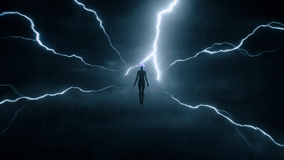

# Silhouette transformation in a lightning void

- **Category:** Cinematic & VFX
- **Clip:** 30s · 16:9 · run on Dreamina
- **Prompt:** reconstructed by apimodels.app from the finished clip. A writing reference, **not** the author's prompt. MIT, full text below.
- **Source:** [@LudovicCreator](https://x.com/LudovicCreator/status/2083976170932989982) — video by its author, linked for reference
- **In the gallery:** https://apimodels.app/seedance-2-5-prompts#prompt-c97a008aa714f8203046fcc07



## Why this one is worth reading

The author describes this as an existing transformation prompt "adapted to a 30 sec length" — the single most useful sentence in this whole library. Going from 10s to 30s is not padding; it is splitting one event into staged states, each with an end condition the next stage inherits.

## Prompt

```text
[GOAL]
Generate a 30-second transformation sequence. The core subject is <FIGURE>, a human form kept as a near-total silhouette from the first frame to the last. The main event is <FIGURE> walking out of a dark storm void and assuming a fully formed sorcerer aspect, with the silhouette never breaking.

[STAGE ONE]
Opens with:   a black void of low fog. Forked white lightning crawls horizontally on both sides of frame. <FIGURE> is a small distant shape walking straight toward camera.
Main event:   <FIGURE> closes the distance in an unbroken push; the hair catches light first and begins to burn as iridescent plasma in pink, mint and violet.
Ends with:    a chest-up frame of <FIGURE>, face entirely black, plasma hair fully lit, eyes not yet open.

[STAGE TWO]
Carried over: the same void, the same fog level, the same plasma hair colours, the same total silhouette on the face and body.
Main event:   two narrow white slits ignite where the eyes are and resolve into detailed glowing irises. Armour assembles onto the silhouette from the shoulders down — a high sculpted collar, layered pauldrons, and three crescent marks lit on the chest.
Ends with:    <FIGURE> standing full-length in centre frame, armour complete, one hand open at the side.

[STAGE THREE]
Main event:   <FIGURE> raises the open hand and lightning bends into the palm, twisting into a rigid staff of light; a circular sigil ignites on the ground underfoot; <FIGURE> spreads both arms and releases a radial burst.
Ends with:    the burst at full extension, <FIGURE> centred and still a silhouette, the sigil still lit.

[KEEP CONSISTENT]
Keep the face in full silhouette in every frame — never light the features. Keep the plasma hair colour order, the collar and pauldron shapes and the crescent marks stable once formed. Keep the camera axis frontal throughout; do not orbit.

The image is near-black high-key-on-black: teal and cold white lightning as the only key light, deep haze, no fill, crushed blacks with the subject read purely as edge and rim. Anamorphic flare on each strike.

The camera holds frontal and pushes in step by step across the three stages, from an extreme wide to a face close-up and back out to a full-length wide, cutting only on lightning strikes.

Sound includes low sub-bass pressure that rises across the whole clip, sharp thunder cracks synchronised to each visual strike, an electrical crackle that tightens as the hair ignites, a single ringing tone when the sigil lights, and no dialogue.
```

**Run it** — Seedance 2.5 is live on apimodels.app as `seedance-2.5`: $0.134/s at 480p, $0.300/s at 720p, billed on real token usage and charged only on success.

```bash
curl -X POST https://apimodels.app/api/v1/video/generations \
  -H "Authorization: Bearer $APIMODELS_API_KEY" -H "Content-Type: application/json" \
  -d '{"model":"seedance-2.5","prompt":"<the prompt above>","duration":30,"resolution":"480p"}'
```

The author's "adapted to 30 sec" is this `duration` field, and it is also what moves the bill: 30 s is $4.02 at 480p and $9.00 at 720p (4–30 s in one pass, or `-1` to let the model choose). The API exposes 480p and 720p only. [Docs](https://apimodels.app/docs/seedance-2-5) · [model](https://apimodels.app/models/seedance-2.5)

## 提示词(中文)

```text
【目标】
生成一段 30 秒的变身序列。核心主体是 <人物>：一个从第一帧到最后一帧都保持近乎全剪影的人形。主线事件是 <人物> 从黑暗风暴虚空中走出，完成术者形态的成形，而剪影始终不被打破。

【第一阶段】
开场状态：低垂薄雾的漆黑虚空。白色枝状闪电在画面两侧横向爬行。<人物> 是远处一个朝镜头径直走来的小小身形。
主线事件：<人物> 在一次不间断的推进中拉近距离；头发最先接到光，开始以粉、薄荷绿与紫罗兰的虹彩等离子体燃烧。
结束状态：<人物> 的胸部以上景别，面部全黑，等离子头发完全点亮，眼睛尚未睁开。

【第二阶段】
承接状态：同一个虚空、同样的雾量、同样的等离子发色，面部与身体依旧是全剪影。
主线事件：眼睛的位置点起两道细白裂缝，随后化为有细节的发光虹膜。装甲自肩部向下在剪影上组装成形——高耸的雕塑感立领、层叠护肩，胸口亮起三道弦月标记。
结束状态：<人物> 全身站立于画面中央，装甲成形，一只手在身侧张开。

【第三阶段】
主线事件：<人物> 抬起张开的那只手，闪电弯折注入掌心，绞成一根刚性的光之长杖；脚下地面亮起圆形法阵；<人物> 双臂张开，释放放射状爆发。
结束状态：爆发扩至最大，<人物> 居中且仍是剪影，法阵仍在发光。

【保持一致】
每一帧都保持面部全剪影——永远不要照亮五官。等离子头发的颜色顺序、立领与护肩造型、弦月标记一旦成形就不得改变。镜头轴线全程正面，不做环绕。

画面呈现黑底上的近黑高反差：青白色闪电是唯一主光，浓雾，无补光，黑位压死，主体只靠边缘光与轮廓读出。每次雷击带变形宽银幕炫光。

镜头保持正面，随三个阶段逐级推进：从极远景到面部特写，再退回全身广角，只在雷击瞬间切换。

声音包括贯穿全片持续攀升的超低频压迫感、与每次视觉雷击严格同步的炸雷、头发点燃时逐渐收紧的电流噼啪声、法阵亮起时的一记长鸣，没有对白。
```

---

> 这条的中文说明:作者说这是把已有的变身提示词「改写成 30 秒版本」——整个库里最有用的一句话。从 10 秒到 30 秒不是加水，而是把一个事件拆成若干阶段状态，每段都给出下一段要继承的结束条件。

**用 API 跑这条** — `seedance-2.5` 已在 apimodels.app 上线，命令同上：480p $0.134/秒、720p $0.300/秒，按真实用量计费，只在成功时扣费。

作者说的「改写成 30 秒」，在 API 上就是 `duration`，它同时也是账单的开关——30 秒 480p 约 $4.02，720p 约 $9.00（单次 4–30 秒，或填 `-1` 让模型自己定）。API 只开放 480p 和 720p。文档：[/docs/seedance-2-5](https://apimodels.app/docs/seedance-2-5)
