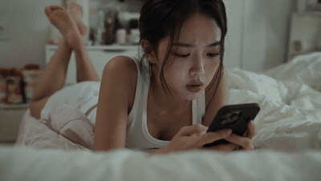

# Seven-shot bedroom candid — cat, phone call, doorbell

- **Category:** Dialogue & Lip Sync
- **Clip:** 15s · 16:9 · run on Higgsfield
- **Prompt:** published by the author — full text on the [gallery page](https://apimodels.app/seedance-2-5-prompts#prompt-c50b543be1ee8d4b7e609bbc0), not copied into this repo (we do not own it).
- **Source:** [@oggii_0](https://x.com/oggii_0/status/2085640281941307648) — video by its author, linked for reference
- **In the gallery:** https://apimodels.app/seedance-2-5-prompts#prompt-c50b543be1ee8d4b7e609bbc0



## Why this one is worth reading

A 15-second clip cut into seven numbered shots with explicit second ranges, four Korean lines with lip sync, and a closing foley cue sheet. The last two sentences are the negative constraints — "no subtitles, no on-screen text, no logo, no watermark. Never render a reference sheet or duplicate the subject" — which is how you stop a reference-driven job from drawing the reference sheet itself.

## Excerpt

```text
Montage, multi-shot candid observational footage. Do not use a single camera angle or continuous take. Handheld documentary style with the feeling of accidental real-life capture. Slightly imperfect framing, subtle handheld shake, tiny reframing adjustments, gentle exposure breathing, and autofocus that settles half a beat late. Realistic skin texture, soft indoor natural light, film grain, shallow depth of field. Relaxed breathing, natural blinking, restrained and authentic performance. Total of 7 shots. The woman from @ Image 1 is wearing a matching cotton pajama set consisting of a scoop-ne…
```

The full 3,789-character prompt is on the [gallery page](https://apimodels.app/seedance-2-5-prompts#prompt-c50b543be1ee8d4b7e609bbc0) with credit to its author, and in [the original post](https://x.com/oggii_0/status/2085640281941307648).

**Run it** — Seedance 2.5 is live on apimodels.app as `seedance-2.5`: $0.134/s at 480p, $0.300/s at 720p, billed on real token usage and charged only on success.

```bash
curl -X POST https://apimodels.app/api/v1/video/generations \
  -H "Authorization: Bearer $APIMODELS_API_KEY" -H "Content-Type: application/json" \
  -d '{"model":"seedance-2.5","prompt":"<the full prompt from the gallery page>","duration":15,"resolution":"480p"}'
```

Seven shots in 15 s costs $2.01 at 480p, $4.50 at 720p; if you stretch the shot list, `duration` is what moves the bill (4–30 s in one pass, or `-1` to let the model choose). The API exposes 480p and 720p only.

The `@Image 1` here is a person: a raw photo that appears to contain a real person is rejected at create time, so real faces go through the `asset://` portrait library. [Docs](https://apimodels.app/docs/seedance-2-5) · [model](https://apimodels.app/models/seedance-2.5)

---

> 这条的中文说明:15 秒切成七个带精确秒段的镜头，四句韩语台词要求口型对上，结尾是一整份拟音清单。最后两句是负向约束——不要字幕、不要屏幕文字、不要 logo 和水印，永远不要把参考图本身画出来、不要复制主体——这正是防止参考驱动的任务把参考拼图画进成片的写法。

**用 API 跑这条** — `seedance-2.5` 已在 apimodels.app 上线，命令同上（prompt 换成画廊页的全文）：480p $0.134/秒、720p $0.300/秒，按真实用量计费，只在成功时扣费。

七个镜头压在 15 秒里：480p 约 $2.01，720p 约 $4.50；要把镜头表拉长，动的就是 `duration`，它也是账单的开关（单次 4–30 秒，或填 `-1` 让模型自己定）；API 只开放 480p 和 720p。这条的 `@图1` 是真人——看起来含真人的原图会在创建时被上游审核拒掉，真人一律走 `asset://` 人像库。文档：[/docs/seedance-2-5](https://apimodels.app/docs/seedance-2-5)
