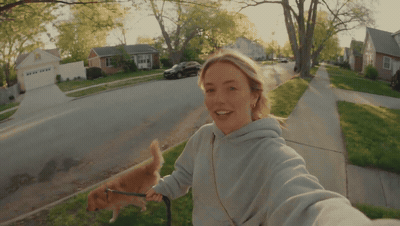

# Handheld DV morning dog-walk vlog

- **Category:** Candid & Handheld
- **Clip:** 15s · 16:9
- **Prompt:** published by the author — full text on the [gallery page](https://apimodels.app/seedance-2-5-prompts#prompt-cf387801f8c35408450aff56f), not copied into this repo (we do not own it).
- **Source:** [@maxxmalist](https://x.com/maxxmalist/status/2085422370362110168) — video by its author, linked for reference
- **In the gallery:** https://apimodels.app/seedance-2-5-prompts#prompt-cf387801f8c35408450aff56f



## Why this one is worth reading

Built from six labelled blocks — CAMERA, LOOK, STYLE, CHARACTER, SETTING, SCENES — instead of one paragraph. Note that the flaws are specified on purpose: autofocus hunting, exposure breathing, brief accidental face cropping. Asking for imperfection is what separates "vlog" from "commercial".

## Excerpt

```text
CAMERA: Handheld DV 16mm daily vlog footage. The video MUST begin with her holding the camera at arm's length in selfie mode while stepping outside her apartment building with her dog. The first 20–30 seconds are entirely handheld. Later she occasionally places the camera on a park bench, low stone wall, picnic table, or the ground for wider shots. Keep subtle handheld shake, drifting composition, autofocus hunting, rushed reframing, uneven zooms, exposure breathing, brief accidental face cropping, and imperfect framing throughout. The camera itself is never visible. LOOK: Warm analog tape tex…
```

The full 2,823-character prompt is on the [gallery page](https://apimodels.app/seedance-2-5-prompts#prompt-cf387801f8c35408450aff56f) with credit to its author, and in [the original post](https://x.com/maxxmalist/status/2085422370362110168).

**Run it** — Seedance 2.5 is live on apimodels.app as `seedance-2.5`: $0.134/s at 480p, $0.300/s at 720p, billed on real token usage and charged only on success.

```bash
curl -X POST https://apimodels.app/api/v1/video/generations \
  -H "Authorization: Bearer $APIMODELS_API_KEY" -H "Content-Type: application/json" \
  -d '{"model":"seedance-2.5","prompt":"<the full prompt from the gallery page>","duration":15,"resolution":"480p"}'
```

The clip is 15 s ($2.01 at 480p, $4.50 at 720p) even though the prompt talks about "the first 20–30 seconds" — length is decided by `duration`, not by the text, and it is also what moves the bill (4–30 s in one pass, or `-1` to let the model choose). The API exposes 480p and 720p only. [Docs](https://apimodels.app/docs/seedance-2-5) · [model](https://apimodels.app/models/seedance-2.5)

---

> 这条的中文说明:不是一整段，而是 CAMERA / LOOK / STYLE / CHARACTER / SETTING / SCENES 六个带标签的块。注意它是**刻意要缺陷**的：自动对焦来回拉、曝光呼吸、偶尔把脸切掉一半。主动要求不完美，才是 vlog 和广告片的分界线。

**用 API 跑这条** — `seedance-2.5` 已在 apimodels.app 上线，命令同上（prompt 换成画廊页的全文）：480p $0.134/秒、720p $0.300/秒，按真实用量计费，只在成功时扣费。

成片是 15 秒（480p 约 $2.01，720p 约 $4.50），尽管提示词里写着「前 20—30 秒」——片长由 `duration` 决定，不由文字决定，它同时也是账单的开关（单次 4–30 秒，或填 `-1` 让模型自己定）。API 只开放 480p 和 720p。文档：[/docs/seedance-2-5](https://apimodels.app/docs/seedance-2-5)
