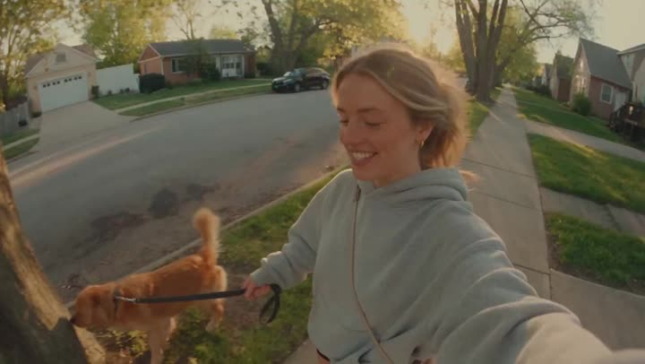

# Handheld DV morning dog-walk vlog

- **Category:** Candid & Handheld
- **Clip:** 15s · 16:9
- **Prompt:** published by the author — full text on the [gallery page](https://apimodels.app/seedance-2-5-prompts#prompt-cf387801f8c35408450aff56f), not copied into this repo (we do not own it).
- **Source:** [@maxxmalist](https://x.com/maxxmalist/status/2085422370362110168) — video by its author, linked for reference
- **In the gallery:** https://apimodels.app/seedance-2-5-prompts#prompt-cf387801f8c35408450aff56f



## Why this one is worth reading

Built from six labelled blocks — CAMERA, LOOK, STYLE, CHARACTER, SETTING, SCENES — instead of one paragraph. Note that the flaws are specified on purpose: autofocus hunting, exposure breathing, brief accidental face cropping. Asking for imperfection is what separates "vlog" from "commercial".

## Excerpt

```text
CAMERA: Handheld DV 16mm daily vlog footage. The video MUST begin with her holding the camera at arm's length in selfie mode while stepping outside her apartment building with her dog. The first 20–30 seconds are entirely handheld. Later she occasionally places the camera on a park bench, low stone wall, picnic table, or the ground for wider shots. Keep subtle handheld shake, drifting composition, autofocus hunting, rushed reframing, uneven zooms, exposure breathing, brief accidental face cropping, and imperfect framing throughout. The camera itself is never visible. LOOK: Warm analog tape tex…
```

The full 2,823-character prompt is on the [gallery page](https://apimodels.app/seedance-2-5-prompts#prompt-cf387801f8c35408450aff56f) with credit to its author, and in [the original post](https://x.com/maxxmalist/status/2085422370362110168).

---

> 这条的中文说明:不是一整段，而是 CAMERA / LOOK / STYLE / CHARACTER / SETTING / SCENES 六个带标签的块。注意它是**刻意要缺陷**的：自动对焦来回拉、曝光呼吸、偶尔把脸切掉一半。主动要求不完美，才是 vlog 和广告片的分界线。
