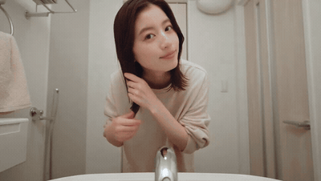

# Thirty-second selfie day-in-the-life

- **Category:** 30s & Multi-Shot
- **Clip:** 30s · 16:9
- **Prompt:** reconstructed by apimodels.app from the finished clip. A writing reference, **not** the author's prompt. MIT, full text below.
- **Source:** [@onofumi_AI](https://x.com/onofumi_AI/status/2083560874443432048) — video by its author, linked for reference
- **In the gallery:** https://apimodels.app/seedance-2-5-prompts#prompt-cb233d1612918f6dd6c62fa87



## Why this one is worth reading

The author put a number on it: roughly ¥1,500 for the 30 seconds. Worth remembering when you read a prompt this long — every re-roll costs the same as the first take, which is the real argument for writing end states per stage instead of iterating.

## Prompt

```text
[GOAL]
Generate a 30-second first-person phone vlog. The core subject is <WOMAN>, in her late twenties, shoulder-length dark brown hair, light natural makeup, who films herself at arm's length through one ordinary day. The main event is a full day compressed into short handheld beats, ending back where it started.

[STAGE ONE — morning at home]
Opens with:   <WOMAN> sitting on the edge of an unmade bed in beige loungewear, holding the phone at arm's length, soft window light, plain white room.
Main event:   she brushes her teeth at the bathroom mirror with the phone in her free hand, then changes and checks the outfit — white blouse, blue midi skirt, cream cardigan, small shoulder bag.
Ends with:    <WOMAN> dressed, bag on, standing at the front door.

[STAGE TWO — out]
Carried over: the same outfit, hair and bag; the same phone-in-hand framing.
Main event:   she pulls the door shut behind her and walks a quiet suburban street, still filming herself, talking to the camera in short sentences with the wind catching her hair.
Ends with:    <WOMAN> pushing open a café door.

[STAGE THREE — café and home]
Main event:   an iced latte and a slice of strawberry shortcake; a close insert of the fork lifting a bite; she pulls an exaggerated delighted face at the lens; then the walk home along the same street at sunset.
Ends with:    <WOMAN> back on the sofa in the same apartment, waving once at the lens and reaching to stop the recording.

[KEEP CONSISTENT]
Keep <WOMAN>'s face, hair length and outfit stable from the moment she dresses until the final shot. Keep the apartment identical between the opening and closing scenes. Keep the phone in her hand and never show the phone itself or a second camera operator.

The image is photoreal front-facing phone footage: wide short-lens perspective with mild edge distortion, rolling-shutter wobble, aggressive auto-exposure correction when she steps outdoors, natural skin texture with visible pores, and no colour grading beyond the phone's own processing.

The camera is handheld at arm's length for every outdoor beat, propped and static for the café inserts, and cuts hard between beats with no transitions.

Sound includes room tone, running water, the door lock, street ambience with birds and one distant car, café clatter and low conversation, the fork on the plate, and <WOMAN> speaking short casual lines to camera with accurate lip sync. No music.
```

**Run it** — Seedance 2.5 is live on apimodels.app as `seedance-2.5`: $0.134/s at 480p, $0.300/s at 720p, billed on real token usage and charged only on success.

```bash
curl -X POST https://apimodels.app/api/v1/video/generations \
  -H "Authorization: Bearer $APIMODELS_API_KEY" -H "Content-Type: application/json" \
  -d '{"model":"seedance-2.5","prompt":"<the prompt above>","duration":30,"resolution":"480p"}'
```

Put a number on the re-roll argument above: at 30 s each attempt is $4.02 at 480p, $9.00 at 720p — `duration` (4–30 s in one pass, or `-1` to let the model choose) is the only real cost lever. The API exposes 480p and 720p only. [Docs](https://apimodels.app/docs/seedance-2-5) · [model](https://apimodels.app/models/seedance-2.5)

## 提示词(中文)

```text
【目标】
生成一段 30 秒的第一人称手机 vlog。核心主体是 <女生>：二十多岁末，深棕色齐肩发，淡妆，全程手臂伸直自拍，记录平常的一天。主线事件是把一整天压缩成若干手持短段落，最后回到起点。

【第一阶段——早晨在家】
开场状态：<女生> 穿米色家居服坐在没整理的床边，手臂伸直举着手机，柔和的窗光，素白房间。
主线事件：她一手拿手机，在浴室镜前刷牙；随后换装并检查搭配——白衬衫、蓝色中长裙、奶油色开衫、小挎包。
结束状态：<女生> 穿戴完毕、背上包，站在玄关门口。

【第二阶段——出门】
承接状态：同一套衣服、同样的发型和包；同样的手持自拍取景。
主线事件：她随手把门带上，走在安静的住宅区街道上，仍在自拍，对着镜头用短句说话，风把头发吹乱。
结束状态：<女生> 推开一家咖啡馆的门。

【第三阶段——咖啡馆与回家】
主线事件：一杯冰拿铁和一块草莓奶油蛋糕；插入叉子挑起一口的特写；她对着镜头做出夸张的满足表情；随后在日落时沿同一条街走回家。
结束状态：<女生> 回到同一间公寓的沙发上，对镜头挥一次手，伸手去停止录制。

【保持一致】
从换好衣服那一刻起到最后一个镜头，<女生> 的脸、发长和穿搭必须稳定。开场与结尾的公寓必须完全相同。手机始终在她手里，不要拍到手机本体，也不要出现第二个摄影者。

画面呈现写实的前置手机画质：广角短焦透视带轻微边缘畸变、果冻快门抖动、走到户外时激进的自动曝光修正、能看到毛孔的真实皮肤质感，除手机自身处理之外不做任何调色。

镜头在所有户外段落都是手臂伸直的手持；咖啡馆插入镜头为架住的固定机位；段落之间硬切，不用任何转场。

声音包括室内环境声、水流声、门锁声、带鸟叫和一辆远处汽车的街道环境声、咖啡馆的杯盘声与低语、叉子碰盘子的声音，以及 <女生> 对着镜头说的几句随意短句，口型必须对上。没有配乐。
```

---

> 这条的中文说明:作者给了个数字：30 秒大约 1500 日元。读这么长的提示词时值得记住——每次重跑和第一次一样贵，这正是「按阶段写清结束状态」而不是反复试的真实理由。

**用 API 跑这条** — `seedance-2.5` 已在 apimodels.app 上线，命令同上：480p $0.134/秒、720p $0.300/秒，按真实用量计费，只在成功时扣费。

给上面那句「重跑一样贵」补个数：30 秒每跑一次，480p 约 $4.02，720p 约 $9.00——`duration` 是唯一真正决定成本的参数（单次 4–30 秒，或填 `-1` 让模型自己定）。API 只开放 480p 和 720p。文档：[/docs/seedance-2-5](https://apimodels.app/docs/seedance-2-5)
