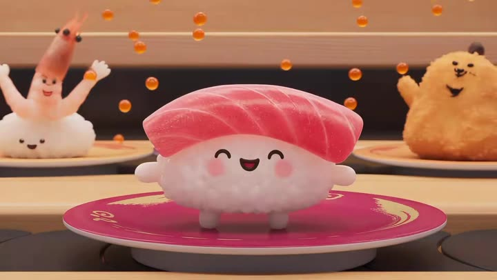

# The rice that rode the belt looking for its topping

- **Category:** Product & Ads
- **Clip:** 30s · 16:9 · run on Dreamina / 即梦
- **Prompt:** reconstructed by apimodels.app from the finished clip. A writing reference, **not** the author's prompt. MIT, full text below.
- **Source:** [@hahazwei](https://x.com/hahazwei/status/2085219893180563470) — video by its author, linked for reference
- **In the gallery:** https://apimodels.app/seedance-2-5-prompts#prompt-c82040b18cad435259556cd3e



## Why this one is worth reading

The author states this was made with no reference images at all — pure text, one pass, 30 seconds. That is the specific claim worth testing: character consistency across a whole spot held by description alone.

## Prompt

```text
[GOAL]
Generate a 30-second animated brand film for a conveyor-belt sushi restaurant. The core subject is <SHARI>, a palm-sized ball of vinegared sushi rice with a simple drawn face, blush cheeks and two stubby feet, riding the belt alone on a plate. The main event is <SHARI> passing topping after topping that does not suit it, until the one that does arrives.

[STAGE ONE]
Opens with:   a shallow-focus track along the conveyor belt at rice height. Finished nigiri glide past on coloured plates; <SHARI> sits on a red plate, bare, with a small worried frown.
Main event:   <SHARI> looks up at each neighbour on the belt — a plump shrimp nigiri, a row of fried croquettes, a slab of seared tuna — and shrinks a little each time.
Ends with:    <SHARI> alone in the centre of frame, plate still moving, shoulders low.

[STAGE TWO]
Carried over: the same belt direction, the same restaurant, the same <SHARI> proportions and face.
Main event:   toppings try themselves on. A spill of salmon roe lands and sits too heavy; a whole fried prawn flops across and overhangs both ends; <SHARI> tips face-first toward a dish of soy sauce and comes up dripping and startled.
Ends with:    <SHARI> bare again, tilted, one foot planted to steady the plate, mildly indignant.

[STAGE THREE]
Main event:   a single slice of fatty tuna descends into frame with a soft rim of light, settles across <SHARI> and fits exactly. <SHARI> straightens up, beams, and lifts both arms; roe scatters upward like confetti and a croquette on the next plate cheers.
Ends with:    the camera lifts off the belt into a slow top-down of the whole circular counter, every plate a different colour, the belt turning once.

[KEEP CONSISTENT]
Keep <SHARI>'s size, face design, blush placement and foot shape stable in every shot. Keep the belt travelling in one direction throughout, the wood counter, warm interior lighting and plate colours unchanged, and never give <SHARI> arms until the final celebration.

The image is soft-shaded 3D character animation with a pastel palette, rounded silhouettes, subsurface-scattered rice grains, warm practical lighting off pale wood, and a shallow macro depth of field that keeps the belt behind the subject creamy.

The camera stays at rice height on a slow parallel dolly for the first two stages, cutting only on belt movement, then releases into a single crane move to overhead at the end.

Sound includes the low hum and rubber tick of the conveyor, plates knocking gently, a light playful ukulele-and-marimba cue that lands its first downbeat on the tuna slice, small non-verbal squeaks from <SHARI>, and no dialogue.
```

## 提示词(中文)

```text
【目标】
生成一段 30 秒的回转寿司品牌动画短片。核心主体是 <醋饭>：一枚手掌大小的寿司醋饭团，有简笔五官、腮红和两只短脚，独自坐在盘子上随传送带前行。主线事件是 <醋饭> 一个个错过不合适的配料，直到属于它的那一片出现。

【第一阶段】
开场状态：镜头贴着醋饭的高度沿传送带平移，浅景深。做好的握寿司在彩色碟子上滑过；<醋饭> 坐在红色碟子上，光秃秃的，微微皱眉。
主线事件：<醋饭> 逐一抬头看身边的邻居——肥厚的甜虾、一排炸可乐饼、一块炙烤金枪鱼——每看一次就往下缩一点。
结束状态：<醋饭> 独自处于画面中央，碟子仍在移动，肩膀塌下去。

【第二阶段】
承接状态：传送带方向不变，餐厅不变，<醋饭> 的比例与五官不变。
主线事件：配料轮番来试。一摊三文鱼籽落下来，压得太沉；一整只炸虾横趴上去，两头都伸出界外；<醋饭> 一头栽向酱油碟，抬起来时滴着酱油、一脸错愕。
结束状态：<醋饭> 重新变回光秃秃的，身子歪着，一只脚撑住碟子，有点气鼓鼓。

【第三阶段】
主线事件：一片大脂金枪鱼带着柔和的轮廓光降下，稳稳盖在 <醋饭> 身上，尺寸严丝合缝。<醋饭> 挺直身子，笑开，双手举起；鱼籽像彩屑一样向上飞散，隔壁碟子上的可乐饼在欢呼。
结束状态：镜头脱离传送带，缓缓升成整张环形吧台的俯视，每个碟子颜色各异，传送带完整转过一圈。

【保持一致】
每个镜头里 <醋饭> 的大小、五官设计、腮红位置和脚型都必须稳定。传送带全程只朝一个方向走，木质吧台、暖色室内光和碟子配色不得改变；在最后的欢呼之前，<醋饭> 不能长出手。

画面呈现柔和上色的三维角色动画：粉彩色调、圆润轮廓、带次表面散射的米粒质感、浅色木材上的暖色实景光，以及把身后传送带化成奶油状虚化的浅微距景深。

镜头前两个阶段保持在醋饭高度做缓慢平行跟移，只在传送带运动中切换；最后一次性升为俯视，一镜完成。

声音包括传送带的低频嗡鸣与橡胶咔哒声、碟子轻碰声、轻快的尤克里里加马林巴配乐（第一个重拍落在金枪鱼盖上的瞬间）、<醋饭> 的非语言小声音效；没有对白。
```

---

> 这条的中文说明:作者说明**完全没给参考图**，纯文字一气呵成 30 秒。这条值得单独验证的正是这一点：整支片子的角色一致性只靠描述撑住。
