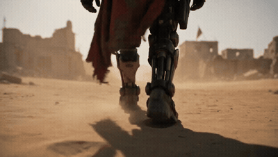

# Red-hooded armoured soldier walking out of desert ruins

- **Category:** Reference & Consistency
- **Clip:** 30s · 16:9 · run on Dreamina
- **Prompt:** reconstructed by apimodels.app from the finished clip. A writing reference, **not** the author's prompt. MIT, full text below.
- **Source:** [@LudovicCreator](https://x.com/LudovicCreator/status/2084217894926258534) — video by its author, linked for reference
- **In the gallery:** https://apimodels.app/seedance-2-5-prompts#prompt-c1dae66061e5fca644483b51e



## Why this one is worth reading

The author says one image reference was used. The reconstruction is written the way the official guide recommends for that case: give the reference an explicit job (@image1 supplies …) and an explicit exclusion (do not take the background), then let the prompt carry the action.

## Prompt

```text
@image1 supplies <SOLDIER>'s armour design, colour breakdown and silhouette: chipped bone-white and gunmetal plating, a heavy respirator faceplate with a single narrow red visor slit, and a sun-bleached crimson hood and cape frayed at the hem. Do not take the background of the reference; do not take any pose from it.

<SOLDIER> walks alone through a bombed-out mud-brick settlement at the flat hour before noon, crossing open sand, passing between collapsed walls, and continuing down the main street without stopping.

The image is anamorphic live-action science fiction: heavy suspended dust, ochre and bleached-bone grade, hard overhead sun with deep contact shadows, sand grain caught in the armour joints, real cloth weight in the cape, and a shallow depth of field that keeps the ruins soft.

The camera works in five moves. It opens at ground level behind <SOLDIER>'s boots as sand collapses under each step and the cape drags through frame. It cuts to a slow push-in on the faceplate, the red visor the only saturated colour in the frame. It tracks laterally past a broken wall so the wall wipes the lens. It follows over the shoulder down the ruined street with the horizon shimmering. It ends on a locked-off wide, <SOLDIER> a black silhouette walking into a blown-out sun at the end of the street.

Keep the armour damage pattern, hood shape, cape length and the position of the visor slit identical in every shot. Keep one figure in frame at all times.

Sound includes wind across open sand, grit under armoured boots, servo movement in the joints, the low filtered rasp of breathing through the respirator, distant loose metal, and a single sustained low drone with no melody.
```

**Run it** — Seedance 2.5 is live on apimodels.app as `seedance-2.5`: $0.134/s at 480p, $0.300/s at 720p, billed on real token usage and charged only on success.

```bash
curl -X POST https://apimodels.app/api/v1/video/generations \
  -H "Authorization: Bearer $APIMODELS_API_KEY" -H "Content-Type: application/json" \
  -d '{"model":"seedance-2.5","prompt":"<the prompt above>","duration":30,"resolution":"480p"}'
```

At 30 s that is $4.02 at 480p and $9.00 at 720p — `duration` (4–30 s in one pass, or `-1` to let the model choose) is what moves the bill. The API exposes 480p and 720p only.

The `@image1` armour board can be made on the same key with `gpt-image-2` ($0.025/image, native 1K/2K/4K) or `gpt-image-2-lite` ($0.008). A faceplate is fine; a raw photo that looks like a real person is rejected at create time — those go through the `asset://` portrait library. [Docs](https://apimodels.app/docs/seedance-2-5) · [model](https://apimodels.app/models/seedance-2.5)

## 提示词(中文)

```text
@图1 提供 <士兵> 的装甲设计、配色关系与剪影：剥落的骨白与枪灰装甲板、带一道窄红目镜缝的厚重呼吸面罩，以及被烈日晒褪、下摆磨损的绯红兜帽与披风。不要采用参考图的背景，也不要沿用其中的姿势。

<士兵> 在正午前那段光线最平的时刻，独自穿过一座被炸毁的土砖聚落：走过开阔沙地，穿行于坍塌的墙体之间，沿主街一直走下去，中途不停。

画面呈现变形宽银幕的真人科幻质感：厚重的悬浮扬尘、赭石与漂白骨色的调色、头顶硬光与深实的接触阴影、卡在装甲缝里的沙粒、披风真实的布料重量，以及让废墟保持柔化的浅景深。

镜头分五次运动。开场贴地跟在 <士兵> 靴后，每一步沙面塌陷、披风扫过画面；切到面罩的缓慢推近，红色目镜是全画面唯一的高饱和色；横向平移经过一堵断墙，让墙体擦镜；越过肩部沿废墟主街跟随，地平线蒸腾扭曲；最后定格为固定广角，<士兵> 成为剪影，走进街道尽头过曝的太阳。

每个镜头里装甲的破损纹样、兜帽形状、披风长度和目镜缝位置必须完全一致。画面中始终只有一个人。

声音包括掠过开阔沙地的风、装甲靴下的砂砾、关节处的伺服声、经呼吸器过滤的低沉喘息、远处松动金属的响动，以及一条没有旋律的持续低频嗡鸣。
```

---

> 这条的中文说明:作者说明只用了一张参考图。这条按官方指南对这种情况的写法复原：给参考素材一个明确职责（@图1 提供……），再给一条明确排除（不要采用背景），动作全部交给提示词本身。

**用 API 跑这条** — `seedance-2.5` 已在 apimodels.app 上线，命令同上：480p $0.134/秒、720p $0.300/秒，按真实用量计费，只在成功时扣费。30 秒 480p 约 $4.02、720p 约 $9.00，`duration` 才是账单的开关（单次 4–30 秒，或填 `-1` 让模型自己定）；API 只开放 480p 和 720p。

`@图1` 那张装甲设定图可以用同一把 key 生成：`gpt-image-2`（$0.025/张，原生 1K/2K/4K）或 `gpt-image-2-lite`（$0.008/张）。面罩没问题；但看起来像真人的照片会在创建时被上游内容审核直接拒掉，真人一律走 `asset://` 人像库。文档：[/docs/seedance-2-5](https://apimodels.app/docs/seedance-2-5)
